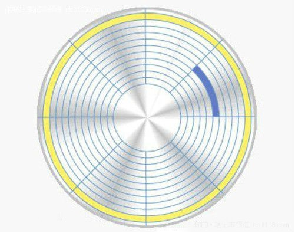
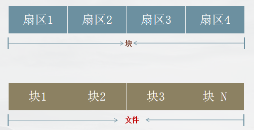
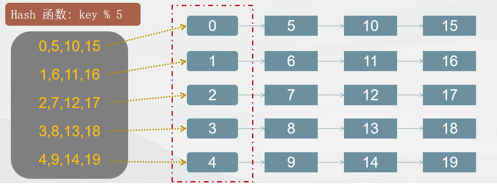

# TFS（淘宝分布式存储引擎）

## 什么是TFS？

> ​	根据淘宝2016年的数据分析，淘宝卖家已经达到900多万，有上十亿的商品。每一个商品有包括大量的图片和文字(平均：15k)，粗略估计下，数据所占的存储空间在1PB 以上，如果使用单块容量为1T容量的磁盘来保存数据，那么也需要1024 x 1024 块磁盘来保存.

> ==思考？==
>
> 	这么大的数据量，应该怎么保存呢？就保存在普通的单个文件中或单台服务器中吗？显然是不可行的。

==淘宝针对海量非结构化数据存储设计出了的一款分布式系统,叫TFS,它构筑在普通的Linux机器集群上,可为外部提供高可靠和高并发的存储访问。==

# 文件系统的基本概念

## 文件系统的接口

==文件系统==：

​	*一种把数据组织成文件和目录的存储方式，提供了基于文件的存取接口，并通过文件权限控制访问。*

------

## 存储的基本单位

> 扇区：
>
> ​	

> 磁盘的每一面被分为很多条磁道，即表面上的一些同心圆，越接近中心，圆就越小。而每一个磁道又按512个字节为单位划分为等分，叫做扇区

## 文件的最小存储单位

*块*

​	==文件存取的最小单位。"块"的大小，最常见的是4KB，即连续八个 sector组成一个 block。==

## 文件结构

Ext*格式化分区 - 操作系统自动将硬盘分成三个区域。

- 目录项区 - 存放目录下文件的列表信息数据区   
- 存放文件数据inode区（inode table）
- 存放inode所包含的信息

## 关于Inode

inode - "索引节点",储存文件的元信息，比如文件的创建者、文件的创建日期、文件的大小等等。每个inode都有一个号码，操作系统用inode号码来识别不同的文件。 `ls -i`  查看inode 号

inode节点大小 - 一般是128字节或256字节。inode节点的总数，格式化时就给定，一般是每1KB或每2KB就设置一个inode。一块1GB的硬盘中，每1KB就设置一个inode，那么inode table的大小就会达到128MB，占整块硬盘的12.8%。

## 读取文件的三个步骤

# 为什么海量存储使用大文件结构

==1.大规模的小文件存取，磁头需要频繁的寻道和换道，因此在读取上容易带来    较长的延时。==

| **千兆网络发送** **1MB** **数据** | **10ms** |
| --------------------------------- | -------- |
| 机房内网络来回                    | 0.5ms    |
| SATA 磁盘寻道                     | 10ms     |
| 从SATA磁盘顺序读取 1MB 数据       | 20ms     |

 ==2.频繁的新增删除操作导致磁盘碎片，降低磁盘利用率和IO读写效率==

 ==3.Inode 占用大量磁盘空间，降低了缓存的效果==

# TFS文件系统的大文件结构

## 设计思路

- 以block文件的形式存放数据文件（一般为64M为一个block），以下简称块，每一个块都有唯一的一个整数编号，块在使用之前所用到的存储空间都会预先分配和初始化
- 每一个块由一个索引文件、一个主块文件和若干个扩展块组成“小文件”主要存放在主块文中，扩展块主要用来存放溢出的数据。
- 每个索引文件存放对应的块信息和“小文件”索引信息，索引文件会在服务启动是映射（mmap）到内存，以便极大的提高文件检索速度。“小文件”索引信息采用在索引文件中的数据结构哈希链表来实现。
- 每个文件有对应的文件编号，文件编号从1开始编号，依次递增，同时作为哈希查找算法的Key 来定位“小文件”在主块和扩展块中的偏移量。文件编号+块编号按某种算法可得到“小文件”对应的文件名。

---

------

## 哈希链表

> 哈希表 - 散列表，它是基于快速存取的角度设计的，也是一种典型的“空间换时间”的做法
>
> 关键点： 	
>
> ​	键(key)：            	文件的编号    如， 1  、 5 、 19  。 。 。                 
>
> ​	值(value)：          	文件的索引信息（包含 文件大小、位置）               
>
> ​	索引:           	     数组的下标(0,1,2,3,4) ，用以快速定位和检索数据                
>
> ​	哈希桶: 保存索引的数组，数组成员为每一个索引值相同的多个元素（以链表的形式链接）的首节点              
>
> ​	哈希函数: 将文件编号映射到索引上，采用求余法 ，如： 文件编号  19  

## 大文件存储结构

## 文件哈希链表的实现图

## 关键数据结构

~~~c
struct BlockInfo
    {
        uint32_t block_id_; //块编号   1 ......2^32-1 TFS = NameServerDataServer
        int32_t version_; 	//块当前版本号
        int32_t file_count_;//当前已保存文件总数
        int32_t size_;		 //当前已保存文件数据总大小
        int32_t del_file_count_;//已删除的文件数量
        int32_t del_size_;	//已删除的文件大小
        uint32_t seq_no_;	//下一个可分配的文件编号 1 ...2^64-1 
        BlockInfo(){
            memset(this, 0, sizeof(BlockInfo));
        }

        inline bool operator==(const BlockInfo &b){
             return (block_id_ == b.block_id_) && (version_ == b.version_) && 							(file_count_ == b.file_count_) && (size_ == b.size_) && 							(del_file_count_ == b.del_file_count_) && (del_size_ 								== b.del_size_) && (seq_no_ == b.seq_no_);
        }
        inline BlockInfo*      block_info(){return this;}

    };

~~~

~~~c
 struct MetaInfo{
    uint64_t fileid_;//文件编号
    struct  {
        int32_t inner_offset_;//文件在块内部的偏移量
        int32_t size_; //文件大小
    } location_;
	//当前哈希链下一个节点在索引文件中的偏移量
    int32_t next_meta_offset_;                                

};

~~~

## 目录结构

# 块的相关操作

## 块的初始化

1. 生成主块文件
   - 根据block_id创建文件
   - 预分配空间
2. 生成索引文件
   - 根据id创建文件
   - 头部初始化
     - 块信息的初始化
     - 索引信息的初始化
   - 同步写入磁盘
   - 映射至内存访问

## 块中写入文件

1. 加载索引文件
   - 映射文件索引至内存
2. 文件写入至主块
   - 从索引文件中读取块数据的偏移
   - 从文件写入主块的对应偏移位置中
3. 文件索引信息写入索引文件
   1. 生成MetaInfo信息（包括文件在块中的fd
   2. 将MetaInfo写入索引文件
   3. 更新块信息（同步写入磁盘

## 块中读取文件

1. 加载索引文件
   - 映射文件至内存
2. 从索引文件中获取MetaInfo
   1. 根据文件id从块索引内存映射的Hash文件链表中查找文件的MetaInfo
3. 根据MetaInfo从块文件中读取文件

## 块中删除文件

1. 加载索引文件
   - 映射索引文件至内存
2. 从索引文件中获取文件MetaInfo
   - 根据文件id从块索引的Hash文件链表中查找文件的MetaInfo
3. 索引文件中删除MetaInfo
   - 将当前文件在对应MetaInfo在哈希链表中的上一个节点指向其后一个节点
   - 当前MetaInfo加入`可重用空闲链表`中
   - 更新快信息
4. (可选)
   1. 把已删除的多个小文件进行彻底删除，同时让所有有效的小文件连续的存储在一起，防止大量碎片化的块空间堆积，

# 设计图

# 文件映射

## 应用场景

> ##  
>
> 1. 进程间共享信息  
>
> 2. 实现文件数据从磁盘到内存的映射，极大的提升应用程序访问文件的速度

## 进程间的通信-文件映射的原理

~~~
原理：	将一个文件或者其它对象映射进内存。
      1.使用普通文件提供的内存映射
      2.使用特殊文件提供匿名内存映射

~~~

## mmap的实现

~~~ cpp
#include <sys/mman.h>
~~~

~~~c

void *mmap(void *addr, size_t length, int prot, int flags,int fd, off_t offset);

int munmap(void *addr, size_t length)
~~~

---

---

==参数addr：==

​	指向欲映射的内存起始地址，通常设为NULL，代表让系统自动选定地址，映射成功后返回该地址。

==参数length:== 

​	代表将文件中多大的部分映射到内存,分页大小的整数倍(4096)

==参数port:==

​	映射区域的保护方式。可以为以下几种方式的组合：

> ​	PROT_EXEC         	执行               
>
> ​	PROT_READ         	读取                          
>
> ​	PROT_WRITE      	  写入             
>
> ​	PROT_NONE       	  不能存取		

​	

---

---

## mysnc

> 实现磁盘文件内容于共享内存区中的内容一致，即同步操作。

函数原型

`int msync ( void * addr, size_t len, int flags)`

头文件	`#include<sys/mman.h>  ` 

addr：文件映射到进程空间的地址；

len：映射空间的大小；

flags：刷新的参数设置，可以取值MS_ASYNC/ MS_SYNC

​	`	其中：取值为MS_ASYNC（异步）时，调用会立即返回，不等到更新的完成；取值为MS_SYNC（同									步）时，调用会等到更新完成之后返回；返回值成功则返回0；失败则返回-1；    `

## mremap

# 映射文件类

`mmap_file.h`

~~~c
 class MMapFile

{
public:
    MMapFile();
    explicit MMapFile(const int fd);
    // explicit MMapFile(const char* path,const MMapOption &option);
    explicit MMapFile(const char *path);
    MMapFile(const MMapOption &option, const int fd);
    virtual ~MMapFile();
    bool syncFile();                               // sync th file
    // Map files to memory and set 	the write authority with false
    bool mmapFile(const bool auth_write = false);  
    // Get the first address mapped to memory to data
    void *getData() const;                         
    // Obtain the size of the mapping data
    int32_t getSize() const;                    
    // ReMap files to memory and set the write authority with false
    bool remapFile(const bool auth_write = false); 
    bool mumapFile();                             	// unmap the file

protected:
    bool ensureFileSize(const int32_t size);

protected:

    void *data_ = nullptr;
    int32_t size_;
    int32_t fd_;
    struct MMapOption mmap_file_option_;

};

~~~

`mmap_file.cpp`

~~~c++
#include "mmap_file.h"

static bool debug = true;

namespace lucifer
{

    namespace tfs
    {

        MMapFile::MMapFile() : size_(0), data_(nullptr), fd_(-1) {}

        MMapFile::MMapFile(const int fd) : size_(0), data_(nullptr), fd_(fd) {}

        MMapFile::MMapFile(const MMapOption &mmap_option, const int fd) : size_(0), data_(nullptr), fd_(fd)
        {

            this->mmap_file_option_.max_mmap_size_ = mmap_option.max_mmap_size_;
            this->mmap_file_option_.per_mmap_size_ = mmap_option.per_mmap_size_;
            this->mmap_file_option_.first_mmap_size_ = mmap_option.first_mmap_size_;
        }

        MMapFile::~MMapFile()
        {
            if (this->data_)
            {
                if (debug)
                {
                    printf("mmap file destruct,fd:%d,maped size:%d,data%p\n", this->fd_, this->size_, this->data_);
                }

                msync(this->data_, this->size_, MS_SYNC);

                munmap(this->data_, this->size_);

                this->size_ = 0;
                this->data_ = nullptr;
                this->fd_ = -1;

                this->mmap_file_option_.first_mmap_size_ = 0;
                this->mmap_file_option_.max_mmap_size_ = 0;
                this->mmap_file_option_.per_mmap_size_ = 0;

                // delete this->data_;
            }
        }

        bool MMapFile::syncFile()
        {
            if (this->data_ != nullptr && this->size_ > 0)
            {
                return msync(this->data_, this->size_, MS_ASYNC) == 0;
            }
            return true;
        }

        bool MMapFile::mmapFile(const bool auth_write)
        {
            int flags = PROT_READ;
            if (auth_write)
            {
                flags |= PROT_WRITE;
            }
            if (this->fd_ < 0)
                return false;

            if (mmap_file_option_.max_mmap_size_ == 0)
                return false;
            if (this->size_ < this->mmap_file_option_.first_mmap_size_)
                this->size_ = this->mmap_file_option_.first_mmap_size_;
            else
                this->size_ = this->mmap_file_option_.max_mmap_size_;
            if (!this->ensureFileSize(size_))
            {
                fprintf(stderr, "ensureFileSize failed in mmapFile ,reason%s\n", strerror(errno));
                return false;
            }

            this->data_ = mmap(0, this->size_, flags, MAP_SHARED, this->fd_, 0);

            if (this->data_ == MAP_FAILED)
            {

                fprintf(stderr, "mmap file failed, resason%s fd:%d,maped size:%d,data%p\n", strerror(errno), this->fd_, this->size_, this->data_);
                this->size_ = 0;
                this->data_ = nullptr;
                this->fd_ = -1;

                return false;

                if (debug)
                    printf("mmap file success,fd:%d,maped size:%d,data%p\n", this->fd_, this->size_, this->data_);

                return true;
            }
            return true;
        }

        void *MMapFile::getData() const { return this->data_; }
        int32_t MMapFile::getSize() const { return this->size_; }

        bool MMapFile::mumapFile()
        {
            if (munmap(this->data_, this->size_) == 0)
                return true;
            else
                return false;
        }

        bool MMapFile::ensureFileSize(const int32_t size)
        {
            struct stat st;
            if (fstat(this->fd_, &st) < 0)
            {
                fprintf(stderr, "fstat erro  ,reason%s\n", strerror(errno));
                return false;
            }
            if (st.st_size < size)
            {
                if (ftruncate(this->fd_, size) < 0)
                {
                    fprintf(stderr, "ensureFileSize failed,reason%s\n", strerror(errno));
                    return false;
                }
                return true;
            }
            // 添加一个默认的返回值，或者修改函数返回类型为void
            return true;
        }

        bool MMapFile::remapFile(const bool auth_write)
        {

            if (this->fd_ < 0 || this->size_ == 0 || this->data_ == nullptr)
            {
                fprintf(stderr, "mremap not mapped yet\n");
                return false;
            }

            if (this->size_ == this->mmap_file_option_.max_mmap_size_)
            {
                if (debug)
                    printf("remap file failed,fd:%d,maped size:%d,data%p\n", this->fd_, this->size_, this->data_);
                fprintf(stderr, "alreadly mapped max size,now size:%d,max size :%d\n", this->size_, this->mmap_file_option_.max_mmap_size_);
                return false;
            }
            int32_t new_size = this->size_ + this->mmap_file_option_.per_mmap_size_;
            // if(new_size > this->mmap_file_option_.max_mmap_size_) new_size= this->mmap_file_option_.max_mmap_size_;
            new_size = (new_size > this->mmap_file_option_.max_mmap_size_) ? this->mmap_file_option_.max_mmap_size_ : new_size;

            if (!this->ensureFileSize(new_size))
            {
                fprintf(stderr, "ensureFileSize failed in remapFile ,reason%s\n", strerror(errno));
                return false;
            }

            void *new_map_data = mremap(this->data_, this->size_, new_size, MREMAP_MAYMOVE, auth_write ? PROT_WRITE : PROT_READ);

            if (DEBUG)
                printf("remap file,fd:%d,maped size:%d,new size:%d old data :%p new data %p\n", this->fd_, this->size_, new_size, this->data_, new_map_data);

            if (MAP_FAILED == new_map_data)
            {
                fprintf(stderr, "mremap failed new_map_data is MAP_FAILD,reason%s new size :%d fd:%d \n", strerror(errno), new_size, this->fd_);
                return false;
            }
            else
            {

                if (DEBUG)
                    printf("mremap success new_map_data:%p,new size:%d\n", new_map_data, new_size);
            }
            this->data_ = new_map_data;
            this->size_ = new_size;
            return true;
        }

    }
}
~~~

# 映射文件操作类

`mmap_file_op.h`

~~~cpp
#ifndef TFS_MMAP_FILE_OPERATION_H
#define TFS_MMAP_FILE_OPERATION_H

#include "head.h"
#include "file_op.h"
#include "mmap_file.h"

namespace lucifer
{
    namespace tfs
    {

        class MMapFileOperation : public FileOperation
        {
        public:
        
            MMapFileOperation(const std::string& file_name, int open_flags = O_RDWR|O_LARGEFILE) 
                : FileOperation(file_name, open_flags), map_file_(nullptr), is_mapped(false) {}

            ~MMapFileOperation();

            int mmap_file(const MMapOption &mmap_option);
            int munmap_file();
            int pread_file(char *buf, const int32_t size, const int64_t offset);
            int pwrite_file(const char *buf, const int32_t size, const int64_t offset);
           
            void *get_map_data() const;
            int flush_file();

        private:
            MMapFile *map_file_;
            bool is_mapped;
        };

    }
}

#endif //! TFS_MMAP_FILE_OPERATION_H	
~~~

`mmap_file_op.cpp`

~~~cpp
#include "mmap_file_op.h"
#include <inttypes.h>
 
static int debug = 1;

namespace lucifer
{
    namespace tfs
    {

        MMapFileOperation::~MMapFileOperation()
        {
            if (map_file_)
            {
                delete (map_file_);
                map_file_ = nullptr;
            }
        }

       

        int MMapFileOperation::munmap_file()
        {
            if (this->is_mapped && this->map_file_ != nullptr)
            {
                delete (this->map_file_);
                this->is_mapped = false;
            }
            return TFS_SUCCESS;
        }

        int MMapFileOperation::mmap_file(const MMapOption &mmap_option)
        {
            if (mmap_option.max_mmap_size_ <= 0)
            {
                return TFS_ERROR;
            }
            if (mmap_option.max_mmap_size_ < mmap_option.first_mmap_size_)
                return TFS_ERROR;
            int fd = this->check_file();
            if (fd < 0)
            {
                fprintf(stderr, "MMapFileOpation::mmap_file checking faild ");
                return TFS_ERROR;
            }
            if (!is_mapped)
            {
                if (nullptr == this->map_file_)
                {
                    delete map_file_;
                }
                map_file_ = new MMapFile(mmap_option, fd);
                this->is_mapped = this->map_file_->mmapFile(true);
            }

            if (this->is_mapped)
            {
                return TFS_SUCCESS;
            }
            else
            {
                return TFS_ERROR;
            }
        }

        void *MMapFileOperation::get_map_data() const
        {

            if (this->is_mapped)
            {
                return this->map_file_->getData();
            }
            return nullptr;
        }

        int MMapFileOperation::pread_file(char *buf, const int32_t size, const int64_t offset)
        {
            // 如果读取不全可以考虑使用while
            // 内存已经映射
            if (this->is_mapped && (offset + size) > map_file_->getSize())
            {
                if (DEBUG)
                {
                    fprintf(stdout, "mmapFileOperation pread file, size: %d, offset: %" PRId64 ", map file size: %d. need remap\n", size, offset, map_file_->getSize());
                }
                this->map_file_->remapFile(); // 追加内存
            }
            if (is_mapped && (offset + size) <= this->map_file_->getSize())
            {
                memcpy(buf, (char *)map_file_->getData() + offset, size);

                return TFS_SUCCESS;
            }
            // 映射不全 内存没有映射或者是要读取的数据不全
            return FileOperation::pread_file(buf, size, offset);
        }

        int MMapFileOperation::pwrite_file(const char *buf, const int32_t size, const int64_t offset)
        {

            if (is_mapped && (offset + size) > this->map_file_->getSize())
            {
                if (DEBUG)
                {
                    fprintf(stdout, "mmapFileOperation pwrite file, size: %d, offset: %" PRId64 ", map file size: %d. need remap\n", size, offset, map_file_->getSize());
                }
                this->map_file_->remapFile(); // 追加内存
            }

            if (is_mapped && (offset + size) <= this->map_file_->getSize())
            {
               // memccpy((char*)map_file_->getData()+offset,buf,size);
                memcpy((char*)map_file_->getData()+offset,buf,size);
                return TFS_SUCCESS;
            }

            //内存没有映射or写入映射数据补全
            return FileOperation::pwrite_file(buf,size,offset);//or write
        }

        int MMapFileOperation::flush_file(){
            if(is_mapped){
                if(map_file_->syncFile())
                {
                    return TFS_SUCCESS;
                }else{
                    return TFS_ERROR;
                }
            }

          return int();
        }

    }

}

~~~

# 文件操作类

~~~cpp
#ifndef TFS_FILE_OP_H_
#define TFS_FILE_OP_H_

#include "head.h"

namespace lucifer
{

    namespace tfs
    {

        class FileOperation
        {
        public:
            FileOperation();
            FileOperation(const std::string &file_name, const int open_flags = O_RDWR | O_LARGEFILE);
            virtual ~FileOperation();

            void close_file();
            int open_file();
            int flush_file(); // write thre file to the disk
            int unlink_file();
            virtual int pread_file(char *buf, const int32_t nbytes, const int64_t offset);
            virtual int pwrite_file(const char *buf, const int32_t nbytes, const int64_t offset);

            virtual int write_file(const char *buf, const int32_t nbytes);
            virtual int read_file( char *buf, const int32_t nbytes);
            int64_t get_file_size();

            int ftruncate_file(const int64_t length);
            int seek_file(const int64_t offset);
            
            int get_fd()const;

        protected:
            int fd_;
            int open_flags_;
            char* file_name_;
            int64_t file_size_;
            int disk_times_;
        protected:
            static constexpr mode_t OPEN_MODE = 0644;
            static constexpr int MAX_DISK_TIMES = 5;
        protected:
            int check_file();
        };

    }
}

#endif // TFS_FILE_OP_H_
~~~

~~~cpp
#include "file_op.h"
#include "head.h"

namespace lucifer
{

    namespace tfs
    {

        FileOperation::FileOperation() {}
        FileOperation::FileOperation(const std::string &file_name, const int open_flags)
            : fd_(-1), open_flags_(open_flags)
        {
            this->file_name_ = strdup(file_name.c_str());
        }
        FileOperation::~FileOperation()
        {
            if (this->fd_ > 0)
                ::close(this->fd_);
            if (nullptr != file_name_)
            {
                free(file_name_);
                file_name_ = nullptr;
            }
        }

        int FileOperation::open_file()
        {
            if (this->fd_ > 0)
            {
                close(fd_);
            }

            this->fd_ = ::open(this->file_name_, this->open_flags_, OPEN_MODE);

            if (this->fd_ < 0)
            {
                return -errno;
            }
            return fd_;
        }

        void FileOperation::close_file()
        {
            if (this->fd_ > 0)
            {
                ::close(this->fd_);
                this->fd_ = -1;
            }
            return;
        }

        int64_t FileOperation::get_file_size()
        {
            int fd = this->check_file();
            if (fd < 0)
                return -1;
            struct stat st;
            if (fstat(fd, &st) < 0)
                return -1;
            return st.st_size;
        }

        int FileOperation::check_file()
        {
            if (this->fd_ < 0)
            {
                this->fd_ = this->open_file();
            }

            return this->fd_;
        }

        int FileOperation::ftruncate_file(const int64_t length)
        {
            int fd = this->check_file();
            if (fd < 0)
                return -1;
            return ftruncate(fd, length);
        }
        // move
        int FileOperation::seek_file(const int64_t offset)
        {
            int fd = this->check_file();
            if (fd < 0)
                return -1;
            return lseek(fd, offset, SEEK_SET);
        }
        int FileOperation::flush_file()
        {
            if (this->open_flags_ & O_SYNC)
            {
                return 0;
            }
            int fd = this->check_file();
            if (fd < 0)
                return -1;
            return fsync(fd);
        }

        int FileOperation::unlink_file()
        {
            if (this->fd_ > 0)
            {
                this->close_file();
                this->fd_ = -1;
            }
            return ::unlink(this->file_name_);
        }

        int FileOperation::get_fd() const
        {
            return this->fd_;
        }

        int FileOperation::pread_file(char *buf, const int32_t nbytes, const int64_t offset)
        {
            int fd = this->check_file();
            if (fd < 0)
                return -1;

            int32_t left = nbytes; // 剩余字节
            int64_t read_offset = offset;
            int32_t read_len = 0;
            char *p_tmp = buf;
            int i = 0;
            while (left > 0)
            {
                ++i;
                if (i >= MAX_DISK_TIMES)
                    return -1;
                if (this->check_file() < 0)
                    return -errno;
                read_len = ::pread64(fd, p_tmp, left, read_offset);
                if (read_len < 0)
                {
                    read_len = -errno;
                    if (read_len == -EINTR || -EAGAIN == read_len)
                        continue;
                    else if (-EBADF == read_len)
                    {
                        // fd_ = -1;
                        return read_len;
                    }
                    else
                    {

                        return read_len;
                    }
                }
                else if (0 == read_len)
                {
                    break;
                }

                left -= read_len;
                p_tmp += read_len;
                read_offset += read_len;
            }
            if (0 != left)
            {
                return EXIT_DISK_OPER_INCOMPLETE;
            }
            return TFS_SUCCESS;
        }

        int FileOperation::pwrite_file(const char *buf, const int32_t nbytes, const int64_t offset)
        {
            int fd = this->check_file();
            if (fd < 0)
            {
                return -1;
            }

            int32_t left = nbytes; // 剩余字节
            int64_t write_offset = offset;
            int32_t write_len = 0;
            const char *p_tmp = buf;
            int i = 0;
            while (left > 0)
            {
                ++i;
                if (i >= MAX_DISK_TIMES)
                    return -1;
                write_len = ::pwrite64(fd, p_tmp, left, write_offset);
                if (write_len < 0)
                {
                    write_len = -errno;
                    if (-write_len == EINTR || EAGAIN == -write_len)
                        continue;
                    else if (EBADF == -write_len)
                    {
                        // fd_ = -1;
                        continue;
                    }
                    else
                    {
                        return write_len;
                    }
                }

                left -= write_len;
                p_tmp += write_len;
                write_offset += write_len;
            }
            if (0 == left)
                return TFS_SUCCESS;

            return EXIT_DISK_OPER_INCOMPLETE;
        }

        int FileOperation::write_file(const char *buf, const int32_t nbytes)
        {
            int fd = this->check_file();
            if (fd < 0)
                return -1;
            int32_t left = nbytes; // 剩余字节
            const char *p_tmp = buf;
            int i = 0;
            while (left > 0)
            {
                ++i;
                if (i >= MAX_DISK_TIMES)
                    return -1;
                int32_t write_len = ::write(fd, p_tmp, left);
                if (write_len < 0)
                {
                    write_len = -errno;
                    if (-write_len == EINTR || EAGAIN == -write_len)
                        continue;
                    else if (EBADF == -write_len)
                    {
                        // this->fd_ = -1; // 使用 fd 替换 fd_
                        continue;
                    }
                    else
                    {
                        return write_len;
                    }
                }

                left -= write_len;
                p_tmp += write_len;
            }
            if (0 == left)
            {
                return TFS_SUCCESS;
            }
            return EXIT_DISK_OPER_INCOMPLETE;
        }

        int FileOperation::read_file(char *buf, const int32_t nbytes)
        {
            int fd = this->check_file();
            if (fd < 0)
            {
                if (DEBUG)
                {
                    std::cout << "fd < 0" << std::endl;
                }
                return -1;
            }

            char *p_tmp = buf;
            int32_t left = nbytes;
            int i = 0;
            while (left > 0)
            {
                ++i;
                if (i >= MAX_DISK_TIMES)
                    return -1;
                int32_t read_len = ::read(fd, p_tmp, left);
                std::cout << "read_len: " << read_len << std::endl;
                if (read_len < 0)
                {
                    read_len = -errno;
                    if (-read_len == EINTR || EAGAIN == -read_len)
                        continue;
                    else if (EBADF == -read_len)
                    {
                        if (DEBUG)
                        {
                            std::cout << "is EBADF" << std::endl;
                        }
                        return -1; // 直接返回错误码
                    }
                    else
                    {
                        if (DEBUG)
                        {
                            std::cout << "is else" << std::endl;
                        }
                        return read_len;
                    }
                }
                else if (read_len == 0)
                {
                    // 文件读取结束
                    break;
                }
                left -= read_len;
                p_tmp += read_len;
            }
            std::cout<<"The left is "<<left<<std::endl;
            // 检查剩余字节数
            if (left != 0)
            {
                if (DEBUG)
                {
                    std::cout << "left != 0" << std::endl;
                }
                return EXIT_DISK_OPER_INCOMPLETE;
            }

            return TFS_SUCCESS;
        }

    }
    
}
~~~

# 公用头文件

~~~cpp
#ifndef HEAD_H_INCLUDED
#define HEAD_H_INCLUDED

#include <cstdint>
#include <stdio.h>
#include <stdint.h>
#include <stdlib.h>
#include <string.h>
#include <unistd.h>
#include <sys/types.h>
#include <sys/stat.h>
#include <fcntl.h>
#include <sys/mman.h>
#include <errno.h>
#include <iostream>
#include <string>
#include <cstring>
#include <cassert>
#include <sstream>
 

namespace lucifer
{
    namespace tfs
    {

        // read or write length is less than required
        constexpr   const       int32_t         EXIT_DISK_OPER_INCOMPLETE                           =           -8012;
        constexpr   const       int32_t         TFS_SUCCESS                                         =           0;
        constexpr   const       int32_t         UNKNOWN_OPERATION                                   =           -8013;
        constexpr   const       bool            DEBUG                                               =           true;
        constexpr   const       int32_t         TFS_ERROR                                           =           -8014;
        static      const       std::string     MAINLOCK_DIR_PREFIX                                 =           "/mainblock/";
        static      const       std::string     INDEX_DIR_PREFIX                                    =           "/index/";
        static      const       mode_t          DIR_MODE                                            =           0755;
        constexpr   const       int32_t         EXIT_INDEX_ALREADY_LOADED_ERROR                     =           -8015;
        constexpr   const       int32_t         EXIT_META_UNEXPECT_FOUND_ERROR                      =           -8016;
        constexpr   const       int32_t         EXIT_INDEX_CORRUPT_ERROR                            =           -8017;
        constexpr   const       int32_t         EXIT_BLOCKID_CONFLICT_ERROR                         =           -8018;    
        constexpr   const       int32_t         EXIT_BUCKET_CONFLICT_ERROR                          =           -8019;      
        constexpr   const       int32_t         EXIT_MEFA_NOT_FOUND_ERROR                           =           -8020;  
        constexpr   const       int32_t         EXIT_BLOCKID_ZERO_ERROR                             =           -8021;
        constexpr   const       int32_t         UNKNOWN_ERROR                                       =           -8022;
        constexpr   const       int32_t         EXIT_BLOCK_NOT_EXIST                                =           -8023;
        constexpr   const       int32_t         EXIT_BLOCK_DEL_FILE_COUNT_LESSZERO                  =           -8024;
        constexpr   const       int32_t         EXIT_BLOCK_DEL_SIZE_LESSZEOR                        =           -8025;
        constexpr   const       int32_t         EXIT_META_NOT_FOUND_ERROR                           =           -8026;
        constexpr   const       int32_t         MAINBLOCK_DIR_PREFIX                                =           -8027;
        enum OperType{
            C_OPER_INSERT = 1,
            C_OPER_DELETE
        };

        struct MMapOption
        {

            int32_t max_mmap_size_;
            int32_t first_mmap_size_;
            int32_t per_mmap_size_;
        };

        struct BlockInfo
        {
            uint32_t block_id_;
            int32_t version_;
            int32_t file_count_;
            int32_t size_;
            int32_t del_file_count_;
            int32_t del_size_;
            uint32_t seq_no_;
            BlockInfo()
            {
                memset(this, 0, sizeof(BlockInfo));
            }
            inline bool operator==(const BlockInfo &b)
            {
                return (block_id_ == b.block_id_) && (version_ == b.version_) && (file_count_ == b.file_count_) && (size_ == b.size_) && (del_file_count_ == b.del_file_count_) && (del_size_ == b.del_size_) && (seq_no_ == b.seq_no_);
            }
            inline BlockInfo*      block_info(){return this;}
            
        };

        struct MetaInfo
        {
        private:
            uint64_t fileid_;
            struct  
            {
                int32_t inner_offset_;
                int32_t size_;
            } location_;

            int32_t next_meta_offset_;

        public:
            MetaInfo()
            {
                init();
            }
            MetaInfo(const uint64_t fileid, const int32_t inner_offset, const int32_t size,
                     const int32_t next_meta_offset)
            {

                fileid_ = fileid;
                location_.inner_offset_ = inner_offset;
                location_.size_ = size;
                this->next_meta_offset_ = next_meta_offset;
            }

            MetaInfo(const MetaInfo &other)
            {
                // 使用内存拷贝赋值
                memcpy(this, &other, sizeof(MetaInfo));
            }

            uint64_t get_key() const { return fileid_; }
            void set_key(const uint64_t key) { fileid_ = key; }
            uint64_t get_file_id() const { return fileid_; }
            void set_file_id(const uint64_t file_id) { fileid_ = file_id; }

            int32_t get_inner_offset() const { return location_.inner_offset_; }
            void set_inner_offset(const int32_t inner_offset) { location_.inner_offset_ = inner_offset; }

            int32_t get_size() const { return location_.size_; }
            void set_size(const int32_t file_size) { location_.size_ = file_size; }

            int32_t get_next_meta_offset() const { return next_meta_offset_; }
            void set_next_meta_offset(const int32_t next_meta_offset) { next_meta_offset_ = next_meta_offset; }

            MetaInfo &operator=(const MetaInfo &other)
            {
                if (this == &other)
                {
                    return *this;
                }

                fileid_ = other.fileid_;
                location_.inner_offset_ = other.location_.inner_offset_;
                location_.size_ = other.location_.size_;
                next_meta_offset_ = other.next_meta_offset_;
            }
            MetaInfo &clone(const MetaInfo &other)
            {
                assert(this != &other);

                fileid_ = other.fileid_;
                location_.inner_offset_ = other.location_.inner_offset_;
                location_.size_ = other.location_.size_;
                next_meta_offset_ = other.next_meta_offset_;
                return *this;
            }

            bool operator==(const MetaInfo &other) const
            {
                return (fileid_ == other.fileid_) && (location_.inner_offset_ == other.location_.inner_offset_) && (location_.size_ == other.location_.size_) && (next_meta_offset_ == other.next_meta_offset_);
            }

        private:
            void init()
            {
                /* fileid_ = 0;
                 location_.inner_offset_ = 0;
                 location_.size_ = 0;
                 next_meta_offset_ = 0;*/
                memset(this, 0, sizeof(MetaInfo));
            }
        };

    }
}

#endif // HEAD_H_INCLUDED
~~~

# index_handle

~~~cpp
#include "index_handle.h"

namespace lucifer
{
    namespace tfs
    {
        IndexHandle::IndexHandle() {}

        IndexHandle::IndexHandle(const std::string &base_path, const int32_t &main_block_id)
        {

            // create file_op_ handle object
            std::stringstream tmp_stream;

            tmp_stream << base_path << INDEX_DIR_PREFIX << main_block_id;

            std::string index_path;
            tmp_stream >> index_path;

            file_op_ = new MMapFileOperation(index_path, O_CREAT | O_RDWR | O_LARGEFILE);

            this->is_load_ = false;
        }

        IndexHandle::~IndexHandle()
        {
            if (file_op_)
            {
                delete this->file_op_;
                this->file_op_ = nullptr;
            }
        }

        int IndexHandle::create(const int32_t logic_block_id, const int32_t bucket_size, const MMapOption map_option)
        {
            int ret;
            if (DEBUG)
            {
                printf("create index\n\tblock id: %u\n\tbucket size: %d\n\tmax_mmap_Size:%d\n\tper mmap size:%d\n\tfirst mmap size:%d\n\n",
                       logic_block_id, bucket_size, map_option.max_mmap_size_, map_option.per_mmap_size_, map_option.first_mmap_size_);
            }
            if (is_load_)
            {
                return EXIT_INDEX_ALREADY_LOADED_ERROR;
            }
            int64_t file_size = this->file_op_->get_file_size();
            if (file_size < 0)
            {
                return TFS_ERROR;
            }
            else if (file_size == 0)
            {
                IndexHeader i_header;

                i_header.block_info_.block_id_ = logic_block_id;
                i_header.block_info_.seq_no_ = 1;
                i_header.bucket_size_ = bucket_size;

                i_header.index_file_size_ = sizeof(IndexHandle) + bucket_size * sizeof(int32_t);
                // index_header + total buckets
                char *init_data = new char[i_header.index_file_size_];
                memcpy(init_data, &i_header, sizeof(IndexHeader));
                memset(init_data + sizeof(IndexHeader), 0, i_header.index_file_size_ - sizeof(IndexHeader));
                // write index header and buckets into index file

                ret = file_op_->pwrite_file(init_data, i_header.index_file_size_, 0);
                delete[] init_data;
                init_data = nullptr;

                if (ret != TFS_SUCCESS)
                {
                    return ret;
                }
                ret = file_op_->flush_file();
                if (ret != TFS_SUCCESS)
                {
                    return ret;
                }
            }
            else // file_size > 0 ,index already exist
            {
                return EXIT_META_UNEXPECT_FOUND_ERROR;
            }
            ret = this->file_op_->mmap_file(map_option);
            if (TFS_SUCCESS != ret)
            {
                return ret;
            }
            is_load_ = true;
            if (DEBUG)
            {

                printf("index successful\n\tinit blockid: %d\n\tdata file size: %d\n\tindex file size: %d\n\tbucket_size: %d\n\tfree head offset: %d\n\tseq no: %d\n\tsize: %d\n\tfilecount: %d\n\tdel size : %d\n\tdel_file_count: %d\n\tversion: %d\n\n",
                       logic_block_id, index_header()->data_file_offset_, index_header()->index_file_size_,
                       index_header()->bucket_size_, index_header()->free_head_offset_,
                       index_header()->block_info_.seq_no_, index_header()->block_info_.size_,
                       index_header()->block_info_.file_count_, index_header()->block_info_.del_size_,
                       index_header()->block_info_.del_file_count_, index_header()->block_info_.version_);
            }
            return TFS_SUCCESS;
        }
        IndexHeader *IndexHandle::index_header()
        {
            return reinterpret_cast<IndexHeader *>(this->file_op_->get_map_data());
        }

        BlockInfo *IndexHandle::block_info()
        {
            return reinterpret_cast<BlockInfo *>(this->file_op_->get_map_data());
        }

        int32_t IndexHandle::bucket_size() const
        {
            return reinterpret_cast<IndexHeader *>(this->file_op_->get_map_data())->bucket_size_;
        }

        int IndexHandle::load(const int32_t logic_block_id, const int32_t bucket_size,
                              const MMapOption map_option)
        {
            int ret = TFS_SUCCESS;

            if (is_load_)
            {
                return EXIT_INDEX_ALREADY_LOADED_ERROR;
            }

            int64_t file_size = this->file_op_->get_file_size();
            if (file_size < 0)
                return file_size;
            else if (file_size == 0)
            {
                printf("----------------file_size: %d\n", file_size);
                return EXIT_INDEX_CORRUPT_ERROR;
            }

            MMapOption tmp_map_option = map_option;
            if (file_size > tmp_map_option.first_mmap_size_ && file_size <= tmp_map_option.max_mmap_size_)
            {
                tmp_map_option.first_mmap_size_ = file_size;
            }
            ret = this->file_op_->mmap_file(tmp_map_option);
            if (TFS_SUCCESS != ret)
            {
                return ret;
            }

            
            if (0 == this->bucket_size() || 0 == block_info()->block_id_)
            {
                if (DEBUG)
                    printf("bucket_size is 0 or block id is 0\n");
                fprintf(stderr, "index corrpurt ,block id: %u,bucket size: %d \n",
                        block_info()->block_id_, this->bucket_size());
                return EXIT_INDEX_CORRUPT_ERROR;
            }

            // check file size
            int32_t index_file_size = sizeof(IndexHeader) + this->bucket_size() * sizeof(int32_t);

            if (file_size < index_file_size)
            {
                fprintf(stderr, "index corrupt error,blockid: %u,\
                    this bucket size: %d,file size : %d,index file size : %d\n ",
                        block_info()->block_id_, this->bucket_size(), file_size, index_file_size);
                return EXIT_INDEX_CORRUPT_ERROR;
            }
            // check block id size
            if (logic_block_id != block_info()->block_id_)
            {
                fprintf(stderr, "block id confict : %u,index blockid : %u\n", logic_block_id, block_info()->block_id_);
                return EXIT_BLOCKID_CONFLICT_ERROR;
            }

            // check bucket size
            if (bucket_size != this->bucket_size())
            {

                fprintf(stderr, "Index configure error,old bucket size: %d,bew bucket size: %d\n", this->bucket_size(), bucket_size);
                return EXIT_BUCKET_CONFLICT_ERROR;
            }
            this->is_load_ = true;
            if (DEBUG)
            {

                printf("Load index handle successful \n\tload blockid:%d\n\tdata file size: %d\n\tindex file size: %d\n\tbucket_size: %d\n\tfree head offset: %d\n\tseq no: %d\n\tsize: %d\n\tfilecount: %d\n\tdel size : %d\n\tdel_file_count: %d\n\tversion: %d\n\n",
                       logic_block_id, index_header()->data_file_offset_, index_header()->index_file_size_,
                       index_header()->bucket_size_, index_header()->free_head_offset_,
                       index_header()->block_info_.seq_no_, index_header()->block_info_.size_,
                       index_header()->block_info_.file_count_, index_header()->block_info_.del_size_,
                       index_header()->block_info_.del_file_count_, index_header()->block_info_.version_);
            }

            return TFS_SUCCESS;
        }

        int IndexHandle::remove(const uint32_t logic_block_id)
        {
            if (is_load_)
            {
                if (logic_block_id != block_info()->block_id_)
                {
                    fprintf(stderr, "block id confict : %u,index blockid : %u\n", logic_block_id, block_info()->block_id_);
                    return EXIT_BLOCKID_CONFLICT_ERROR;
                }
            }
            auto ret = file_op_->munmap_file();

            if (TFS_SUCCESS != ret)
            {
                return ret;
            }

            ret = file_op_->unlink_file();
            return TFS_SUCCESS;
        }

        int IndexHandle::flush()
        {
            int ret = this->file_op_->flush_file();
            if (TFS_SUCCESS != ret)
            {
                fprintf(stderr, "index flush fail,ret:%d error desc:%s\n", ret, strerror(ret));
            }
            return ret;
        }

        int32_t IndexHandle::get_block_data_offset()
        {
            return reinterpret_cast<IndexHeader *>(file_op_->get_map_data())->data_file_offset_;
        }
           int32_t IndexHandle::free_head_offset() const
        {
            return reinterpret_cast<IndexHeader *>(file_op_->get_map_data())->free_head_offset_;
        }

        int32_t IndexHandle::write_segment_meta(const uint64_t key, MetaInfo &meta)
        {

            int32_t current_offset = 0;  // 查找的偏移
            int32_t previous_offset = 0; // 查找的偏移
            // key exist or not
            // find from file hashTbale is exist  (hash_find (key,current_offset))

            int ret = hash_find(key, current_offset, previous_offset);

            if (TFS_SUCCESS == ret)
            {
                return EXIT_META_UNEXPECT_FOUND_ERROR;
            }
            else if (EXIT_MEFA_NOT_FOUND_ERROR != ret)
            {
                return ret;
            }

            // if not exist ,then write the meta to file (hash insert(meta,slot))
            ret = hash_insert(key, previous_offset, meta);
            return ret;
        }

        int32_t *IndexHandle::bucket_slot()
        {
            return reinterpret_cast<int32_t *>(reinterpret_cast<char *>(file_op_->get_map_data()) + sizeof(IndexHeader));
        }

        int32_t IndexHandle::hash_find(const uint64_t key, int32_t &current_offset, int32_t &previous_offset)
        {
            int ret = TFS_SUCCESS;

            // ensure the key slot
            previous_offset = 0;
            current_offset = 0;

            MetaInfo meta_info;
            // 1. 确定key存放的桶（slot）的位置
            int32_t slot = static_cast<uint32_t>(key) % this->bucket_size();
            // 2. 读取桶的首节点存储的第一个节点的偏移量  如果偏移为0 ：EXIT_MEFA_NOT_FOUND_ERROR
            // 3. 根据偏移量读取存储的meta info
            // 4. 与key进行比较，相等就设置啧设置（——curoffset pre_offset 并且返回TFS_SUCCESS,否则执行5
            // 5. 从mefainfo取得下一个节点在文件中间的偏移量 如果偏移为0 ：EXIT_MEFA_NOT_FOUND_ERROR

            int32_t pos = this->bucket_slot()[slot];
            for (; pos != 0;)
            {
                ret = file_op_->pread_file(reinterpret_cast<char *>(&meta_info),
                                           sizeof(MetaInfo), pos);
                if (TFS_SUCCESS != ret)
                {
                    return ret;
                }

                if (hash_compatre(key, meta_info.get_key()))
                {
                    current_offset = pos;
                    return TFS_SUCCESS;
                }
                previous_offset = pos;
                pos = meta_info.get_next_meta_offset();
            }
            return EXIT_MEFA_NOT_FOUND_ERROR;
        }

        int32_t IndexHandle::hash_insert(const uint64_t key, int32_t previous_offset, MetaInfo &meta)
        {
            MetaInfo tmp_meta_info;
            int32_t ret = TFS_SUCCESS;
            int32_t current_offset = 0;
            // 1 确定key存放的slot的位置
            int32_t slot = static_cast<uint32_t>(key) % this->bucket_size();

            // 2 确定meta 节点存储在文件中的存放当前节点的偏移量

            if(free_head_offset()!= 0){
                ret = file_op_->pread_file(reinterpret_cast<char *>(&tmp_meta_info),sizeof(MetaInfo),free_head_offset());
                
                if(TFS_SUCCESS != ret)  return ret;

                current_offset = index_header()->free_head_offset_;
                index_header()->free_head_offset_ = tmp_meta_info.get_next_meta_offset();
                
                if(DEBUG)
                    printf("reuse metainfo ,current offset: %d\n",current_offset);
            }else{
               
                    
                current_offset   = index_header()->index_file_size_;
                index_header()->index_file_size_ += sizeof(MetaInfo);
            }

         

            // 3. 将metainfo写入索引文件中
            meta.set_inner_offset(0);
            ret = file_op_->pwrite_file(reinterpret_cast<const char *>(&meta),
                                        sizeof(MetaInfo), current_offset);
            if (TFS_SUCCESS != ret)
            {
                index_header()->index_file_size_ -= sizeof(MetaInfo);
                return ret;
            }
            // 4. 将meta节点插入哈希链表
           
            if (0 != previous_offset)
            {
                ret = file_op_->pread_file(reinterpret_cast<char *>(&tmp_meta_info), sizeof(MetaInfo), previous_offset);
                if (TFS_SUCCESS != ret)
                {
                    index_header()->index_file_size_ -= sizeof(MetaInfo);
                    return ret;
                }
                tmp_meta_info.set_next_meta_offset(current_offset);

                ret = file_op_->pwrite_file(reinterpret_cast<const char *>(&tmp_meta_info),
                                            sizeof(MetaInfo), current_offset);

                if (TFS_SUCCESS != ret)
                {
                    index_header()->index_file_size_ -= sizeof(MetaInfo);
                    return ret;
                }
            }

            else
            {
                bucket_slot()[slot] = current_offset;
            }

            return TFS_SUCCESS;
        }

        void IndexHandle::commit_block_data_offset(const int file_size)
        {
            reinterpret_cast<IndexHeader *>(this->file_op_->get_map_data())
                ->data_file_offset_ += file_size;
        }

        bool IndexHandle::update_block_info(const OperType oper_type, const uint32_t modify_size)
        {
            if (block_info()->block_id_ == 0)
                return EXIT_BLOCKID_ZERO_ERROR;
            if (oper_type == C_OPER_INSERT)
            {
                ++block_info()->version_;
                ++block_info()->file_count_;
                ++block_info()->seq_no_;
                block_info()->size_ += modify_size;
            }
            else if (oper_type == C_OPER_DELETE)
            {
                ++block_info()->version_;
                --block_info()->file_count_;
                block_info()->size_ -= modify_size;
                ++block_info()->del_file_count_;
                block_info()->del_size_ += modify_size;
            }
            if (DEBUG)
            {
                printf("\n\nupdate  block   info\n\tblockid: %u\n\tversion: %u\n\tfile_count: %u\n\tseq_no: %u\n\tsize: %u\n\tdel_size: %u\n\tdel_file_count: %u\n\n",
                       block_info()->block_id_, block_info()->version_, block_info()->file_count_, block_info()->seq_no_,
                       block_info()->size_, block_info()->del_size_, block_info()->del_file_count_);

                printf("type:%d,modify_size:%d\n", oper_type, modify_size);
            }
            return TFS_SUCCESS;
        }

        int32_t IndexHandle::read_segment_meta(const uint64_t key, MetaInfo &meta)
        {
            int32_t current_offset = 0;
            int32_t previous_offset = 0;

            auto ret = hash_find(key, current_offset, previous_offset);

            if (tfs::TFS_SUCCESS == ret)
            {
                ret = file_op_->pread_file(reinterpret_cast<char *>(&meta), sizeof(MetaInfo), current_offset);
                return ret;
            }
            else
            {
                if (tfs::DEBUG)
                    printf("read segment read not except?\n");
                return ret;
            }
        }

        int32_t IndexHandle::delete_segment_meta(const uint64_t key)
        {

            int32_t current_offset = 0;
            int32_t previous_offset = 0;

            int32_t ret = hash_find(key, current_offset, previous_offset);
            if (TFS_SUCCESS != ret)
                return ret;

            MetaInfo meta_info;
            ret = file_op_->pread_file(reinterpret_cast<char *>(&meta_info), sizeof(MetaInfo), current_offset);
            if (ret != TFS_SUCCESS)
                return ret;
            int32_t next_pos = meta_info.get_next_meta_offset();

            // 为首节点
            if (previous_offset == 0)
            {
                int32_t slot = static_cast<uint32_t>(key) % this->bucket_size();
                this->bucket_slot()[slot] = next_pos;
            }
            else
            { // 普通节点

                MetaInfo pre_meta_info;
                ret = file_op_->pread_file(reinterpret_cast<char *>(&pre_meta_info), sizeof(MetaInfo), previous_offset);
                if (ret != TFS_SUCCESS)
                    return ret;
                
                pre_meta_info.set_next_meta_offset(next_pos);
                ret = file_op_->pwrite_file(reinterpret_cast<const char *>(&pre_meta_info), sizeof(MetaInfo), previous_offset);
                
                if (ret != TFS_SUCCESS)
                    return ret;
            }

            // 加入可重用节点链表
            
            meta_info.set_next_meta_offset(free_head_offset());//index_header()->free_head_offset
            if(DEBUG){
                printf("delete_segment_meta- reuse meta_info,current_offset: %d\n",current_offset);

            }
            ret = file_op_->pwrite_file(reinterpret_cast<const char *>(&meta_info), sizeof(MetaInfo),current_offset);
            
            if(TFS_SUCCESS != ret) return ret;
            
            index_header()->free_head_offset_ = current_offset;
            update_block_info(C_OPER_DELETE, meta_info.get_size());

            return TFS_SUCCESS;
        }

     
    }

}

~~~

~~~c
#ifndef TFS_INDEX_HANDLE_H_
#define TFS_INDEX_HANDLE_H_

#include "head.h"
#include "mmap_file_op.h"
#include "mmap_file.h"

namespace lucifer
{

    namespace tfs
    {

        struct IndexHeader
        {

        public:
            BlockInfo   block_info_;        // meta block info
            int32_t     bucket_size_;       // hash bucket size
            int32_t     data_file_offset_;  // offset to wirte next data in block
            int32_t     index_file_size_;   // offset  after index+header + all buckets
            int32_t     free_head_offset_;  // free meta node list for reuse

            IndexHeader() { memset(this, 0, sizeof(IndexHeader)); }

        };

        class IndexHandle
        {
        public:

            IndexHandle(const std::string& base_path, const int32_t& main_block_id);
            IndexHandle();
            virtual ~IndexHandle();

            int             create(const int32_t logic_block_id,const int32_t bucket_size,const MMapOption map_option);
            int             load  (const int32_t logic_block_id,const int32_t bucket_size,const MMapOption map_option);
            int             remove(const uint32_t logic_block_id);
            int             flush ();
            void            commit_block_data_offset(const int file_size);
            bool            update_block_info(const OperType oper_type,const uint32_t modify_size);
            
            int32_t         bucket_size()const;
            int32_t         get_block_data_offset();
            int32_t         write_segment_meta(const uint64_t key,MetaInfo &meta);
            int32_t         read_segment_meta(const uint64_t key,MetaInfo &meta);
            int32_t         hash_find(const uint64_t key,int32_t &current_offset,int32_t &previous_offset);
            int32_t*        bucket_slot();
            int32_t         hash_insert(const uint64_t key,int32_t previous_offset,MetaInfo &meta);
            int32_t         delete_segment_meta(const uint64_t key);
            int32_t         free_head_offset()const;

            //整理快文件
            int32_t         space_reclamation(FileOperation*);
            
            IndexHeader*    index_header();    
            BlockInfo*      block_info();
        private:
            inline bool hash_compatre(const uint64_t left_key,const uint64_t right_key)
                {return (left_key == right_key);}
        
        private:
            MMapFileOperation*  file_op_;
            bool                is_load_;
            
        
        };

    }
}

#endif // TFS_INDEX_HANDLE_H_
~~~

# 提供的一些测试代码

~~~cpp
#include "head.h"
#include "file_op.h"
#include "index_handle.h"

using namespace lucifer;

const static tfs::MMapOption mmap_option = {1024000, 4096, 4096}; // 内存映射参数

const static uint32_t main_blcok_size = 1014 * 1024 * 64; // 主块文件的大小

const static uint32_t bucket_size = 1000; // 哈希桶的大小

static int32_t block_id = 1;

int main(int argc, char **argv)
{
    std::string mainblock_path;
    std::string index_path;
    int32_t ret = tfs::TFS_SUCCESS;
    tfs::IndexHandle *index_handle = new tfs::IndexHandle(".", block_id);

    std::cout << "Type you bock id:" << std::endl;
    std::cin >> block_id;
   
    if (block_id < 0){
        std::cerr << "Invalid blockid,exit" << std::endl;
        exit(-1);    
    }

    ret = index_handle->load(block_id, bucket_size, mmap_option);
    
    if (ret != tfs::TFS_SUCCESS){
        fprintf(stderr, "Fail to load index:%s ret: %d\n", strerror(errno),ret);
         
        delete index_handle;

        index_handle->remove(block_id);
        exit(-2);
    }
    //删除指定文件的meta info
    uint64_t file_id;

    std::cout << "Type you file_id:" << std::endl;
    std::cin >> file_id;

   
    if (file_id < 1){
        std::cerr << "Invalid blockid,exit" << std::endl;
        exit(-2);    
    }

    ret = index_handle->delete_segment_meta(file_id);

    if(tfs::TFS_SUCCESS != ret){
        fprintf(stderr, "Fail to delete segment meta:%s ret: %d\n", strerror(errno),ret);

        delete index_handle;
        index_handle->remove(block_id);
        exit(-3);
    }

    ret = index_handle->flush();
    if(ret != tfs::TFS_SUCCESS){
        fprintf(stderr,"flush error");
    }

    printf("delete successful \n");
    
     
    //delete index_handle;
    return 0;

}
~~~

~~~cpp
#include "head.h"
#include "file_op.h"
#include "index_handle.h"
 
 
using namespace lucifer;

const static tfs::MMapOption mmap_option = {1024000,4096,4096};//内存映射参数

const static uint32_t main_blcok_size = 1014*1024*64;//主块文件的大小

const static uint32_t bucket_size = 1000;//哈希桶的大小

static int32_t block_id = 1;

int main(int argc,char **argv)
{
    std::string mainblock_path;
    std::string index_path;
    int32_t ret = tfs::TFS_SUCCESS;

    std::cout<<"Type you bock id:"<<std::endl;
    std::cin>>block_id;
    if(block_id < 0){
        std::cerr<<"Invalid blockid,exie"<<std::endl;
        exit(-1);
    }
    //生成主块文件
    std::stringstream tmp_stream;
    tmp_stream << "."<< tfs::MAINLOCK_DIR_PREFIX  <<block_id;
    tmp_stream >> mainblock_path;
    
    tfs::FileOperation * mainblock = new tfs::FileOperation(mainblock_path,O_RDWR|O_LARGEFILE|O_CREAT);

    ret = mainblock->ftruncate_file(main_blcok_size);
    if(ret != 0){
        fprintf(stderr,"Fail to truncate file:%s\n",strerror(errno));
        
        std::cerr<<"Fail to truncate file"<<std::endl;
        delete mainblock;
        
        exit(-2);
    }
    
    //生成索引文件
    tfs::IndexHandle * index_handle = new tfs::IndexHandle(".",block_id);
    if(tfs::DEBUG)
        printf("Create index init\n");
    ret = index_handle->create(block_id,bucket_size,mmap_option);
    if(ret != tfs::TFS_SUCCESS)
    { 
        fprintf(stderr,"Fail to create index:%s\n",strerror(errno));
       
       
        delete mainblock;
        
        index_handle->remove(block_id);
        exit(-3);
    }
  
    mainblock->close_file();
    index_handle->flush();
    delete mainblock;
    delete index_handle;

    //other
    return 0;

 

}
~~~

~~~cpp
#include "head.h"
#include "file_op.h"
#include "index_handle.h"

using namespace lucifer;

const static tfs::MMapOption mmap_option = {1024000, 4096, 4096}; // 内存映射参数

const static uint32_t main_blcok_size = 1014 * 1024 * 64; // 主块文件的大小

const static uint32_t bucket_size = 1000; // 哈希桶的大小

static int32_t block_id = 1;

int main(int argc, char **argv)
{
    std::string mainblock_path;
    std::string index_path;
    int32_t ret = tfs::TFS_SUCCESS;
    tfs::IndexHandle *index_handle = new tfs::IndexHandle(".", block_id);

    std::cout << "Type you bock id:" << std::endl;
    std::cin >> block_id;
   
    if (block_id < 0){
        std::cerr << "Invalid blockid,exit" << std::endl;
        exit(-1);    
    }

    ret = index_handle->load(block_id, bucket_size, mmap_option);
    
    if (ret != tfs::TFS_SUCCESS){
        fprintf(stderr, "Fail to load index:%s\n", strerror(errno));
        std::cerr << "Fail to load index ";
        std::cout << std::endl;
        delete index_handle;

        index_handle->remove(block_id);
        exit(-2);
    }
    
    //2.读取文件的meta info
    uint64_t file_id;

    std::cout << "Type you file_id:" << std::endl;
    std::cin >> file_id;

   
    if (file_id < 1){
        std::cerr << "Invalid blockid,exit" << std::endl;
        exit(-2);    
    }

    
    tfs::MetaInfo meta;

    ret = index_handle->read_segment_meta(file_id,meta);
    if(tfs::TFS_SUCCESS != ret)
    {
        fprintf(stderr,"read_segment_meta error,file_id %lu,ret %d",file_id,ret);
        exit(-3);
    }   
    //3根据meta info读取文件
    //读取主块文件
    std::stringstream tmp_stream;
    tmp_stream << "." << tfs::MAINLOCK_DIR_PREFIX << block_id;
    tmp_stream >> mainblock_path;

    tfs::FileOperation *mainblock = new tfs::FileOperation(mainblock_path, O_RDWR);

    char *buffer = new char[meta.get_size()+1];
    
    ret = mainblock->pread_file(buffer,meta.get_size(),meta.get_inner_offset());
    
    if(ret != tfs::TFS_SUCCESS)
    {
        fprintf(stderr, "read from mainblock %d failed. ret:%d\n", block_id,ret);
        mainblock->close_file();
        delete mainblock;
        delete index_handle;
    }
    else
    {
        if(tfs::DEBUG) printf("write successfully. ret : %u, block_id:%d\n", ret, block_id);
    }
  
    buffer[meta.get_size()] = '\0';
    
    printf("read size %d\ncontent : %s\n",meta.get_size(),buffer);
    mainblock->close_file();
    delete mainblock;
    
   
    delete index_handle;
    return 0;
}

~~~

~~~cpp
#include "head.h"
#include "file_op.h"
#include "index_handle.h"
#include <sstream>

using namespace std;
using namespace lucifer;
using namespace lucifer::tfs;

static const MMapOption mmap_option = {1024000, 4096, 4096};    //内存映射参数
static const uint32_t main_blocksize = 1024 * 1024 * 64;        //主块文件的大小
static const uint32_t bucket_size = 1000;   //哈希桶的大小
static int32_t block_id = 1;

int main(int argc, char** argv)     //比如：argv[0] = "rm"  argv[1] = "-f"  argv[2] = "a.out"   此时  argc = 3
{
	string mainblock_path;
	string index_path;
	int32_t ret = TFS_SUCCESS;	
	
	cout << "type your block id:";
	cin >> block_id;
	
	if(block_id < 1)
	{
		cerr << "Invalid block id, exit\n";
		exit(-1);
	}	
	
	//1.加载索引文件
	IndexHandle* index_handle = new IndexHandle(".", block_id);   //索引文件句柄    //free
	
	if(DEBUG) printf("load index ...\n");
	
	ret = index_handle->load(block_id, bucket_size, mmap_option);
	
	if(ret != TFS_SUCCESS)
	{
		fprintf(stderr, "load index %d faild.\n", block_id);
		//delete mainblock;
		delete index_handle;
		exit(-2);
	}
	
	
	//主块文件
	stringstream tmp_stream;
	tmp_stream << "." << MAINBLOCK_DIR_PREFIX << block_id;
	tmp_stream >> mainblock_path;
	
	FileOperation* mainblock = new FileOperation(mainblock_path, O_RDWR | O_LARGEFILE | O_CREAT);      //free
	
	
	ret = index_handle->space_reclamation(mainblock);
	
	
	if(ret != TFS_SUCCESS)
	{
		fprintf(stderr, "tidy block failed. ret: %d, reason: %s\n", ret, strerror(errno));
		mainblock->close_file();
		
		delete mainblock;
		delete index_handle;
		exit(-3);
	}
	
	
	mainblock->close_file();
	
	delete mainblock;
	delete index_handle;
	
	return 0;
}
	
~~~

~~~cpp
#include "head.h"
#include "mmap_file.h"
#include "mmap_file_op.h"
#include "index_handle.h"

namespace lucifer
{
    namespace tfs

    {
        
        int32_t IndexHandle::space_reclamation(FileOperation* file_op ){

            //查找del_file_count
            //根据文件编号 逐步从头部开始写 hash_find就continue 有就往前写
            //截断文件
            //更新索引信息
            if(!file_op)
                return EXIT_BLOCK_NOT_EXIST;

            if(block_info()->del_file_count_ <= 0)        //块删除文件数量小于0
			{
				fprintf(stderr, "block id %u do not have del_file. del_file_count: %d\n", block_info()->block_id_, block_info()->del_file_count_);
				return EXIT_BLOCK_DEL_FILE_COUNT_LESSZERO;
			}
            	if(block_info()->del_size_ <= 0)             //块删除文件大小小于0
			{
				fprintf(stderr, "block id %u do not have del_file_size. del_file_size:%d\n", block_info()->block_id_, block_info()->del_size_);
				return EXIT_BLOCK_DEL_SIZE_LESSZEOR;
			}
			
            int32_t file_count = block_info()->file_count_;        //文件数量
			int32_t ret = TFS_SUCCESS;
			int32_t over_write_offset = 0;       //整个文件写入块后的偏移量
			int32_t current_write_offset = 0;    //文件未写全，块中的偏移量
		
            int64_t residue_bytes = 0;          //写入后还剩下需要写的字节数
			uint64_t key = 1;         //保存文件编号
			
            			//整理块
			for(int i = 1; i <= file_count; )
			{
				MetaInfo meta_info;            //保存临时读到的metainfo
				char buffer[4096] = { '0' };                 //保存的文件
				int nbytes = sizeof(buffer);        //该次需要写入的字节数
				
				ret = read_segment_meta(key, meta_info);
				
				current_write_offset = meta_info.get_inner_offset();   
				residue_bytes = meta_info.get_size(); 
			
				if(DEBUG) fprintf(stderr, "i: %d, file_id: %ld, key: %ld, ret: %d\n", i, meta_info.get_key(), key, ret);
				
				if(TFS_SUCCESS == ret)           //已经在哈希链表中读到
				{
					
					if(meta_info.get_size() <= sizeof(buffer))        //一次读完
					{	
						ret = file_op->pread_file(buffer, meta_info.get_size(), meta_info.get_inner_offset());      
						if(ret == TFS_SUCCESS)    //文件读成功,将文件重新写入块中
						{
							ret = file_op->pwrite_file(buffer, meta_info.get_size(), over_write_offset);
							if(ret == TFS_SUCCESS)          //文件写入成功
							{
								over_write_offset += meta_info.get_size();
								key++;
							}
							else         //文件未写成功 / 未写全
							{
								return ret;           //可以考虑将读取文件的地址传回(buffer的地址)
							}
						}
						else           //文件未读成功 / 未读全
						{
							return ret;
						}
					}
					else         //需要分多次读写
					{
						nbytes = sizeof(buffer);
						
						for(int j = 0; j < 1; )
						{
							ret = file_op->pread_file(buffer, nbytes, current_write_offset);     
							if(ret == TFS_SUCCESS)    		//文件读成功,将部分文件重新写入块中
							{
								//fprintf(stderr, "nbytes：%d\n", nbytes);
								ret = file_op->pwrite_file(buffer, nbytes, over_write_offset);
								if(ret == TFS_SUCCESS)          //文件写入成功
								{
									current_write_offset += nbytes;
									over_write_offset += nbytes;
									residue_bytes -= nbytes;
									
									//fprintf(stderr, "residue_bytes：%ld\n", residue_bytes);
									
									if(0 == residue_bytes) 
									{
										key++;       
										j++;          //结束循环
										continue;
									}
									
									if(nbytes > residue_bytes)
									{	
										nbytes = residue_bytes;
										continue;
									}
									
								}
								else         //文件未写成功 / 未写全
								{
									return ret;           //可以考虑将读取文件的地址传回(buffer的地址)
								}
							}
							else
							{
								return ret;   //文件未读成功 / 未读全
							}
						}
					}
					
				}
				else if(EXIT_META_NOT_FOUND_ERROR != ret)     //not found key(状态)
				{
					return ret;
				}
				else if(EXIT_META_NOT_FOUND_ERROR == ret)     //哈希链表中没有找到,该文件已被删除
				{
					key++;
					continue;
				}
				
				i++;

			}

            ret = file_op->flush_file();
			//截断文件
			ret = file_op->ftruncate_file(block_info()->size_);
			
			//更新索引文件信息
			index_header()->data_file_offset_ = block_info()->size_;
			
			//更新block info
			ret = block_info()->del_file_count_ = 0;
			ret = block_info()->del_size_ = 0;
			flush();
			
			return TFS_SUCCESS;
			
        }

    } // namespace tfs

    
} // namespace lucifer
 

 
~~~

~~~cpp
#include "head.h"
#include "file_op.h"
#include "index_handle.h"

using namespace lucifer;

const static tfs::MMapOption mmap_option = {1024000, 4096, 4096}; // 内存映射参数

const static uint32_t main_blcok_size = 1014 * 1024 * 64; // 主块文件的大小

const static uint32_t bucket_size = 1000; // 哈希桶的大小

static int32_t block_id = 1;

int main(int argc, char **argv)
{
    std::string mainblock_path;
    std::string index_path;
    int32_t ret = tfs::TFS_SUCCESS;
    tfs::IndexHandle *index_handle = new tfs::IndexHandle(".", block_id);

    std::cout << "Type you bock id:" << std::endl;
    std::cin >> block_id;
   
    if (block_id < 0)
    {
        std::cerr << "Invalid blockid,exit" << std::endl;
        exit(-1);    
    }

    ret = index_handle->load(block_id, bucket_size, mmap_option);
    
    if (ret != tfs::TFS_SUCCESS)
        {
            fprintf(stderr, "Fail to load index:%s ret: %d\n", strerror(errno),ret);
             
            delete index_handle;

            index_handle->remove(block_id);
            exit(-2);
        }
    if (tfs::DEBUG)
        printf("load index ok\n");

    delete index_handle;
    return 0;
}

~~~

~~~c
#include "head.h"
#include "file_op.h"
#include "index_handle.h"

using namespace lucifer;

const static tfs::MMapOption mmap_option = {1024000, 4096, 4096}; // 内存映射参数

const static uint32_t main_blcok_size = 1014 * 1024 * 64; // 主块文件的大小

const static uint32_t bucket_size = 1000; // 哈希桶的大小

const static bool debug = true;
static int32_t block_id = 1;

int main(int argc, char **argv)
{
    std::string mainblock_path;
    std::string index_path;
    int32_t ret = tfs::TFS_SUCCESS;

         
    
    std::cout << "Type your block id:" << std::endl;
    std::cin >> block_id;
 
    if (block_id < 1)
    {
        std::cerr << "Invalid block id , exit." << std::endl;
        exit(-1);
    }

    tfs::IndexHandle *index_handle = new tfs::IndexHandle(".", block_id); // 索引文件句柄
    
    if(tfs::DEBUG)
        printf("Load index in block_write\n");
 
    
    ret = index_handle->load(block_id, bucket_size, mmap_option);

    if (ret != tfs::TFS_SUCCESS){
        fprintf(stderr, "load index %d failed.\n", block_id);
        delete index_handle;
        exit(-2);
    }

    if (tfs::DEBUG)
        printf("load index successful \n");

    //写入主块文件
    std::stringstream tmp_stream;
    tmp_stream << "." << tfs::MAINLOCK_DIR_PREFIX << block_id;
    tmp_stream >> mainblock_path;

    tfs::FileOperation *mainblock = new tfs::FileOperation(mainblock_path, O_RDWR | O_LARGEFILE | O_CREAT);

    
    char buffer[4096];
    memset(buffer, '6', 4096);
    

   
    int32_t data_offset = index_handle->get_block_data_offset();
    uint32_t file_no = index_handle->block_info()->seq_no_;

    ret = mainblock->pwrite_file(buffer, sizeof(buffer), data_offset);

    if (ret != tfs::TFS_SUCCESS)
    {
        fprintf(stderr, "write to mainblock failed.ret:%d, reason:%s\n", ret, strerror(errno));
        mainblock->close_file();

        delete mainblock;
        delete index_handle;
        exit(-3);
    }

    //3.写入metaonfo索引
    struct tfs::MetaInfo meta;

    meta.set_file_id(file_no);
    meta.set_inner_offset(data_offset);
    meta.set_size(sizeof(buffer));

    ret = index_handle->write_segment_meta(meta.get_key(),meta);
    if(debug)
        printf("write segment meta ret is %d\n",ret);

    if(ret == tfs::TFS_SUCCESS){
        //succsssful updata block info
        //1. 更新索引头部信息
        index_handle->commit_block_data_offset(sizeof(buffer));

        //2.更新块信息
        index_handle->update_block_info(tfs::C_OPER_INSERT,sizeof(buffer));
        ret = index_handle->flush();
        if(debug)
            printf("write_segmentmeta is TFS_SUCCESS\n");
        if(ret!=tfs::TFS_SUCCESS)
        {
            fprintf(stdout,"flush mainblock %d faild. file no: %u \n",block_id,file_no);

        }
       

    }else{
        fprintf(stderr,"write_segment_meta - mainblock %d failed.file no %u\n",block_id,file_no);
    }

     if(ret != tfs::TFS_SUCCESS)
    {
        fprintf(stderr, "write to mainblock %d failed. file no:%u\n", block_id, file_no);
        mainblock->close_file();
    }
    else
    {
        if(tfs::DEBUG) printf("write successfully. file no: %u, block_id:%d\n", file_no, block_id);
    }
  

    mainblock->close_file();
    delete mainblock;
    delete index_handle;
    return 0;
}

~~~

~~~c
#include "file_op.h"
#include "head.h"

using namespace std;
using namespace lucifer;

int main(int argc, char* argv[])
{
    constexpr const char * filename = "file_op.txt";
    tfs::FileOperation * fileOP = new tfs::FileOperation(filename,O_LARGEFILE|O_RDWR|O_CREAT);
    int fd = fileOP->open_file();
    if(fd < 0)
    {
        cout << "open file failed" << endl;
        return -1;
    }

    char buffer[65];
    memset(buffer,'8',sizeof(buffer));

  {
      int ret = fileOP->pwrite_file(buffer,sizeof(buffer),1024);
    if(ret < 0)
    {
        cout << "pwrite file failed" << endl;
        return -1;
    }
    
  }
  memset(buffer,0,sizeof(buffer));
  {
    auto ret = fileOP->pread_file(buffer,sizeof(buffer),1024);
    if(ret < 0)
    {
        cout << "pread file failed" << endl;
        return -1;
    }
    buffer[64] = '\0';
    cout << "pread file success" << endl;
    cout << "data: " << buffer << endl;
  }
 
    fileOP->close_file();

    delete fileOP;
    return 0;
}

~~~

